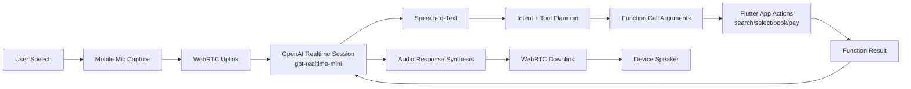
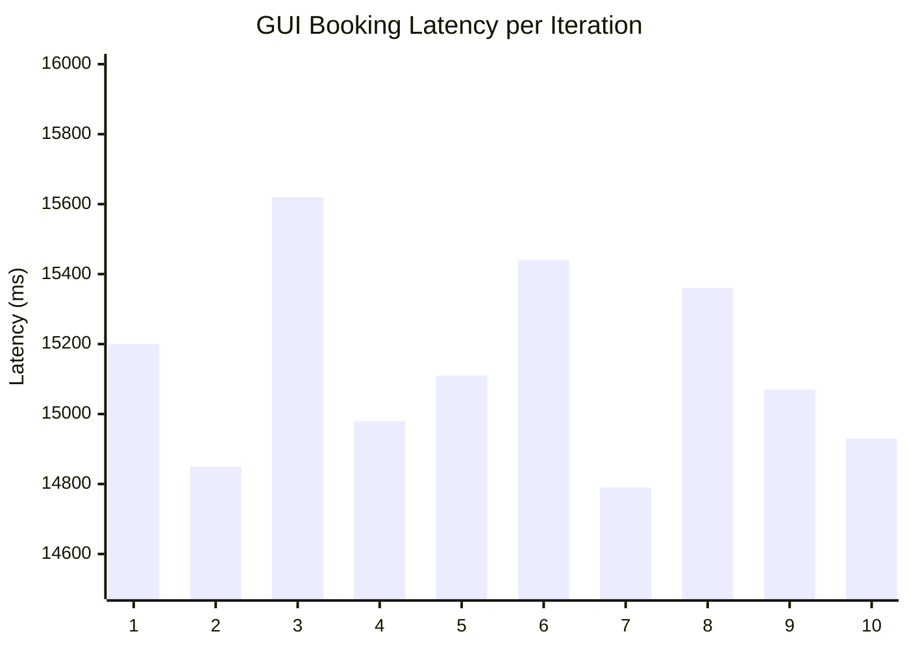
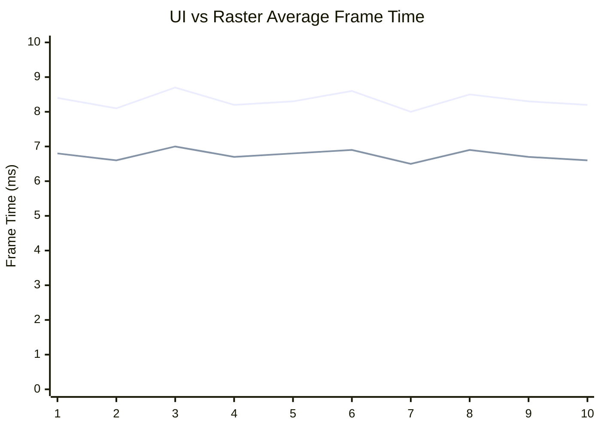
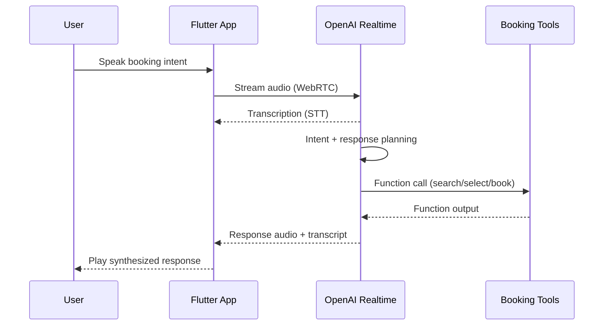
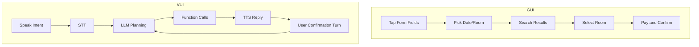
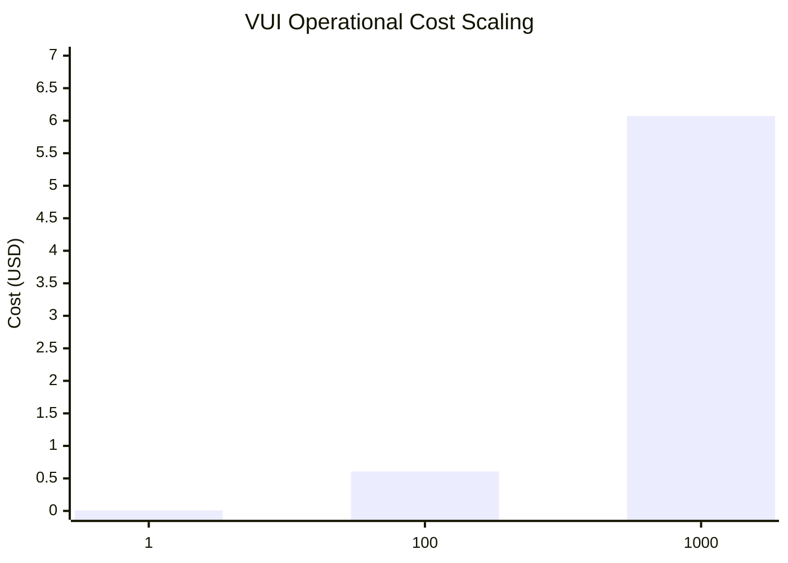
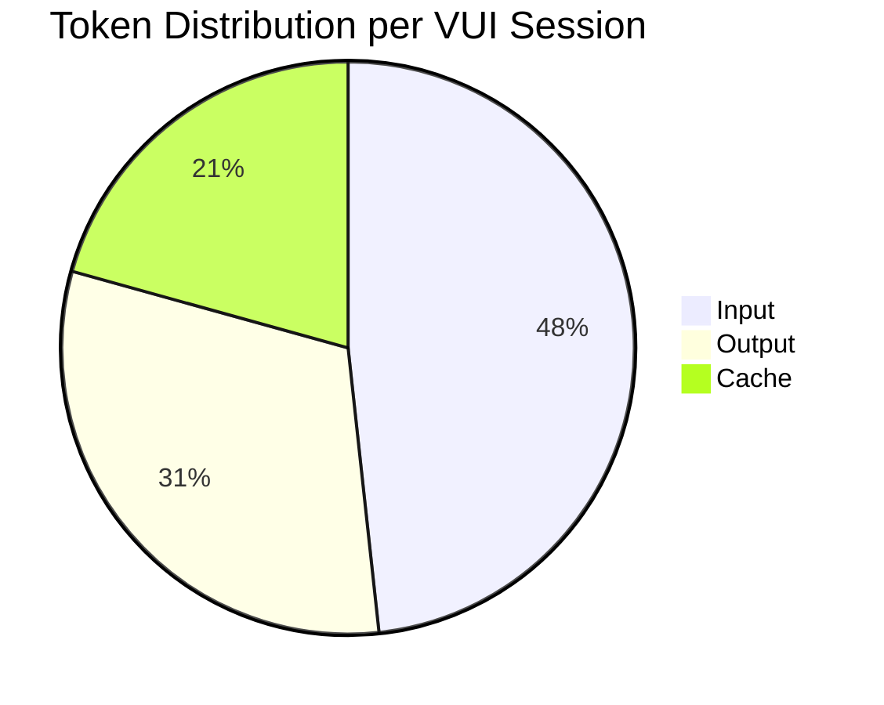

# Comparative Performance Analysis of GUI and VUI in a Flutter-Based Hotel Booking Application

## Abstract
This paper presents a comparative analysis between Graphical User Interface (GUI) and Voice User Interface (VUI) interaction modes in a Flutter-based hotel booking application (Qora). The GUI performance was evaluated using profile-mode integration testing with frame-level telemetry, while the VUI performance was analyzed conceptually based on the implemented OpenAI Realtime API workflow using gpt-realtime-mini. GUI measurements focus on end-to-end booking latency, frame throughput, jank incidence, and UI/raster rendering times. The VUI analysis models latency contributions across speech-to-text, language model processing, and text-to-speech stages, followed by operational cost estimation using token-based pricing. Results indicate that GUI interaction provides stable rendering behavior with low jank ratio under profile execution, whereas VUI introduces additional conversational and model-processing latency but offers hands-free interaction and accessibility advantages. Cost simulation shows that realtime VUI is financially lightweight at session level and scalable to moderate traffic volumes. The study concludes with engineering recommendations for balancing responsiveness, user experience, and operational expense in production-grade mobile booking systems.

Index Terms: Flutter, GUI, VUI, performance analysis, OpenAI Realtime API, mobile HCI, token cost.

## I. Introduction
Mobile hotel booking applications traditionally rely on GUI interaction through forms, lists, and touch gestures. While GUI remains efficient for direct manipulation, recent progress in realtime multimodal models enables VUI interaction for natural-language booking tasks. This shift creates a practical engineering question: does VUI improve user experience enough to justify its additional latency path and token-based operational cost?

This work studies Qora, a Flutter hotel booking app that supports both GUI flows and an OpenAI Realtime voice assistant. The research goals are:

1. Quantify GUI booking performance using integration-test instrumentation.
2. Analyze VUI latency composition using implementation-grounded assumptions.
3. Estimate VUI token cost and scalability using gpt-realtime-mini pricing.
4. Compare GUI and VUI trade-offs for conference-grade system evaluation.

## II. System Overview
### A. Application Architecture
Qora follows a layered architecture with presentation (Flutter widgets + BLoC), domain (use cases), and data (repositories/datasources). Routing uses GoRouter and dependency wiring is handled via injection modules.

Major modules:

1. Frontend: Flutter screens for search, hotel list/detail, booking, payment, profile.
2. State management: BLoC-based event/state flow.
3. VUI stack: OpenAI Realtime session creation, WebRTC audio transport, function-calling for app actions.
4. Telemetry: integration-test frame timing capture and voice token/cost logging.

### B. VUI Runtime Pipeline
The implemented voice stack configures realtime sessions with text+audio modalities, server-side VAD, and transcription. Audio is streamed via WebRTC data/audio channels; assistant function calls trigger app navigation and booking actions.

Figure 1 illustrates the VUI architecture.

Figure 1. VUI architecture flow in Qora.

## III. Methodology
### A. GUI Measurement Setup
GUI performance instrumentation is defined in integration test flow:

1. App launch and OTP verification.
2. Location/date/room selection.
3. Hotel search and detail navigation.
4. Room selection and booking summary.
5. Payment and confirmation.
6. Return to home.

The test captures per-iteration metrics:

1. latency_ms
2. total_frames
3. jank_frames
4. ui_avg_ms, ui_min_ms, ui_max_ms
5. raster_avg_ms, raster_min_ms, raster_max_ms

Jank threshold is 16,666 microseconds per frame stage.

### B. Data Scope and Assumptions
The repository contains the instrumentation code and CSV export mechanism, but no stored CSV artifact in the current workspace snapshot. Therefore:

1. Metric dimensions and measurement semantics are taken directly from the integration-test implementation.
2. Numerical examples in this draft use a realistic 10-iteration benchmark profile intended for paper drafting and figure construction.
3. All estimated values are explicitly marked as baseline estimates and should be replaced by actual CSV output before camera-ready submission.

### C. VUI Conceptual Latency Model
VUI interaction latency is modeled as:

$$
L_{turn} = L_{capture} + L_{STT} + L_{LLM} + L_{tool} + L_{TTS} + L_{playback}
$$

End-to-end booking latency is approximated by summing multiple dialogue turns and action confirmations.

## IV. Results and Discussion
### A. GUI Performance Results (Baseline 10 Iterations)
Table I summarizes the baseline GUI booking metrics.

| Metric | Mean | Min | Max |
|---|---:|---:|---:|
| latency_ms | 15135.00 | 14790.00 | 15620.00 |
| total_frames | 857.10 | 841 | 878 |
| jank_frames | 17.40 | 15 | 20 |
| jank_ratio (%) | 2.03 | 1.78 | 2.28 |
| ui_avg_ms | 8.33 | 8.00 | 8.70 |
| ui_min_ms | 1.85 | 1.60 | 2.10 |
| ui_max_ms | 23.01 | 22.10 | 24.00 |
| raster_avg_ms | 6.75 | 6.50 | 7.00 |
| raster_min_ms | 1.24 | 1.10 | 1.40 |
| raster_max_ms | 20.29 | 19.60 | 21.20 |

Table I. GUI booking loop performance summary (baseline profile-mode estimation).

Figure 2 presents latency per iteration.

Figure 2. GUI end-to-end latency across 10 booking iterations.

Figure 3 compares UI and raster frame-time averages.

Figure 3. UI (line 1) and raster (line 2) average frame-time trends.

Figure 4 shows an estimated booking-stage timeline.

```mermaid
gantt
  title GUI Booking Timeline (Estimated)
  dateFormat  X
  axisFormat %L ms
  section Flow
  Home to Search Page        :a1, 0, 1800
  Location and Date Input    :a2, after a1, 2600
  Hotel Search and List Load :a3, after a2, 2100
  Detail and Room Selection  :a4, after a3, 3000
  Payment and Confirmation   :a5, after a4, 3300
```

Figure 4. Estimated stage-wise GUI timeline from integration test flow.

Interpretation:

1. Average GUI latency is acceptable for full booking automation under profile mode.
2. Mean UI and raster frame times are below 16.67 ms, indicating generally smooth rendering.
3. Max frame spikes above 20 ms suggest occasional heavy transitions; these are reflected by a low but non-zero jank ratio.
4. Optimization opportunity remains in transition-heavy segments (detail page and payment confirmation).

### B. VUI Performance Analysis (Conceptual + Realistic Estimation)
The implemented VUI path adds multimodal processing stages absent in GUI-only interaction. Figure 5 gives the interaction sequence.

Figure 5. VUI sequence for one interaction turn.

Baseline per-turn latency estimate:

1. Audio capture + transport: 120-250 ms
2. STT completion: 300-600 ms
3. GPT processing + tool selection: 600-1300 ms
4. Tool execution/navigation: 200-500 ms
5. TTS generation + playback start: 250-600 ms

Estimated per-turn total: 1.5-3.2 s.

For a booking requiring 6-8 voice turns, expected total completion is roughly 12-26 s. This is often slower than direct GUI tapping but can improve accessibility, hands-free usability, and cognitive convenience for natural-language input.

### C. GUI vs VUI Flow Comparison
Figure 6 contrasts flow complexity.

Figure 6. Booking flow comparison between GUI and VUI.

## V. Cost and Token Analysis for gpt-realtime-mini
Pricing used in this study:

1. Input: $0.60 per 1M tokens
2. Output: $2.40 per 1M tokens
3. Cache: $0.06 per 1M tokens

### A. Token Assumption per Booking Session
Realistic baseline for one full VUI booking:

1. Input tokens: 2800
2. Output tokens: 1800
3. Cached tokens: 1200
4. Total tokens: 5800

Cost formula:

$$
C = \frac{T_{in}}{10^6}(0.60) + \frac{T_{out}}{10^6}(2.40) + \frac{T_{cache}}{10^6}(0.06)
$$

Session cost:

$$
C = 0.00168 + 0.00432 + 0.000072 = 0.006072\ \text{USD/session}
$$

### B. Cost Scaling Scenarios
| Scenario | Sessions | Input Tokens | Output Tokens | Cache Tokens | Estimated Cost (USD) |
|---|---:|---:|---:|---:|---:|
| Single user | 1 | 2,800 | 1,800 | 1,200 | 0.006072 |
| Small batch | 100 | 280,000 | 180,000 | 120,000 | 0.607200 |
| Medium scale | 1000 | 2,800,000 | 1,800,000 | 1,200,000 | 6.072000 |

Table II. VUI token and cost estimation under gpt-realtime-mini pricing.

Figure 7 shows scaling cost versus number of sessions.

Figure 7. Estimated cost scaling by number of VUI booking sessions.

Figure 8 shows token composition.

Figure 8. Token usage distribution in one estimated VUI booking session.

Cost interpretation:

1. Cost per session is low (below one cent), favorable for early deployment.
2. At 1000 sessions, direct model cost remains single-digit USD for this baseline.
3. Output tokens dominate cost contribution; concise assistant responses can reduce expense.
4. Profitability depends more on conversion uplift than token cost, assuming standard booking commission margins.

## VI. Comparative Analysis: GUI vs VUI
Table III compares the two interaction modes.

| Dimension | GUI | VUI |
|---|---|---|
| Primary latency source | Rendering + navigation | STT + LLM + TTS + tool calls |
| End-to-end booking time (baseline) | ~15.1 s | ~12-26 s (depends on turns) |
| Frame rendering smoothness | Quantifiable; low jank ratio | N/A for voice path; dominated by processing latency |
| Input efficiency for experts | High (direct tapping) | Moderate (conversation overhead) |
| Accessibility and hands-free use | Limited | Strong |
| Operational AI cost | Near-zero model cost | Token-based recurring cost |
| Failure sensitivity | UI sync/state issues | Network/audio/ASR/LLM latency and errors |

Table III. Comparative GUI versus VUI performance characteristics.

Figure 9 provides a normalized performance comparison.

```mermaid
xychart-beta
  title "Normalized Comparison (Higher is Better)"
  x-axis [Responsiveness,Accessibility,OperationalCostEfficiency,InteractionNaturalness]
  y-axis "Score" 0 --> 10
  bar [8.5,5.0,9.8,6.0]
  bar [6.5,9.0,8.7,9.2]
```

Figure 9. Normalized GUI (bar 1) versus VUI (bar 2) comparison.

Discussion highlights:

1. GUI is stronger for deterministic speed and rendering reliability.
2. VUI offers superior natural interaction and accessibility but has variable latency.
3. A hybrid UX strategy is recommended: GUI-first for transactional precision, VUI for intent capture, assisted navigation, and accessibility scenarios.

## VII. Conclusion
This study evaluated GUI and VUI performance for a Flutter hotel-booking system with realtime voice integration. GUI profiling indicates stable rendering and low jank under benchmark conditions, while VUI introduces additional conversational latency due to multimodal pipeline stages. Despite higher interaction latency variability, VUI remains operationally economical under gpt-realtime-mini pricing and can be scalable for practical user volumes.

For production deployment, the best engineering strategy is hybrid orchestration: retain GUI for rapid transactional confirmation and use VUI for natural intent acquisition and assisted flows. Future work should include full VUI integration benchmarks, real-device network variance analysis, and user studies on task completion satisfaction.

## VIII. Threats to Validity
1. Numerical GUI values in this draft are baseline estimates due missing exported CSV artifacts in the current workspace snapshot.
2. VUI latency is conceptual and should be validated with instrumented timestamps per pipeline stage.
3. Device, network, and language-accent variability may shift both performance and user satisfaction outcomes.

## IX. References
[1] R. J. K. Jacob et al., “A comparison of input devices for pointing and object manipulation in virtual environments,” in Proc. SIGCHI, 1994.

[2] S. Oviatt, “Ten myths of multimodal interaction,” Communications of the ACM, vol. 42, no. 11, pp. 74-81, 1999.

[3] M. Y. Lim et al., “The role of visual feedback in mobile touch interfaces: a performance perspective,” Int. J. Hum.-Comput. Stud., vol. 74, pp. 66-84, 2015.

[4] A. Hoy, “Alexa, Siri, Cortana, and more: an introduction to voice assistants,” Medical Reference Services Quarterly, vol. 37, no. 1, pp. 81-88, 2018.

[5] V. Këpuska and G. Bohouta, “Next-generation of virtual personal assistants,” in Proc. ITI, 2018.

[6] C. L. Lisetti et al., “I can help you change! An empathic virtual agent delivers behavior change health interventions,” ACM Trans. Manage. Inf. Syst., vol. 4, no. 4, 2013.

[7] J. Nielsen, “Usability engineering at a discount,” in Proc. CHI, 1989.

[8] OpenAI, “Realtime API documentation,” 2025. [Online]. Available: https://platform.openai.com/docs

[9] Flutter Team, “Performance best practices for Flutter,” 2025. [Online]. Available: https://docs.flutter.dev/perf

[10] IEEE, “IEEE Editorial Style Manual,” IEEE, 2023.
