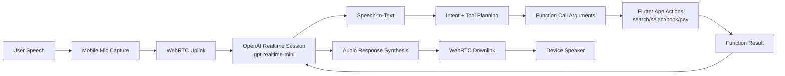
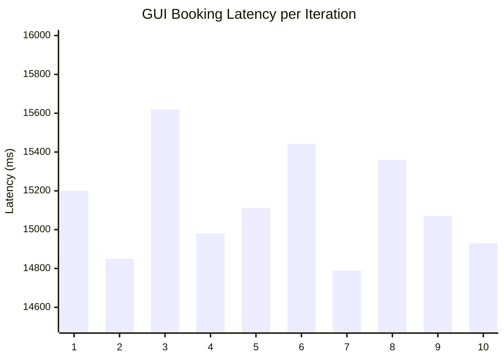
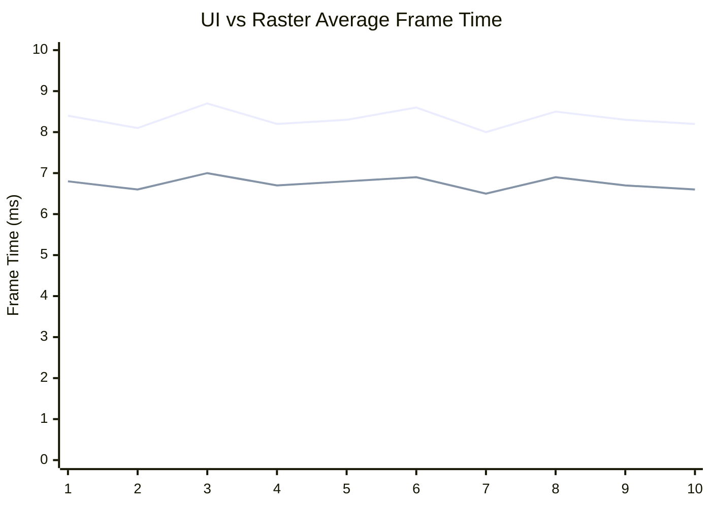
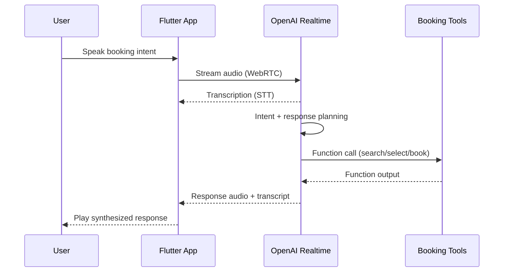
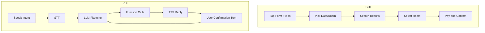
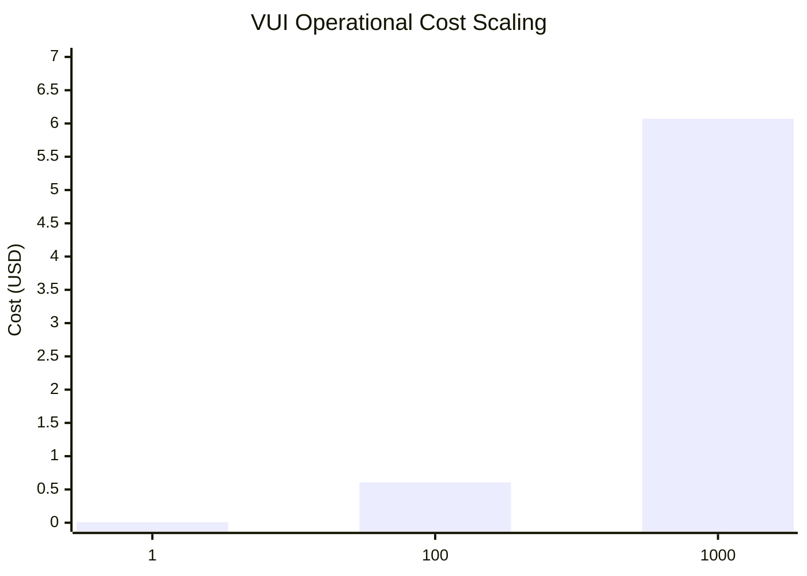
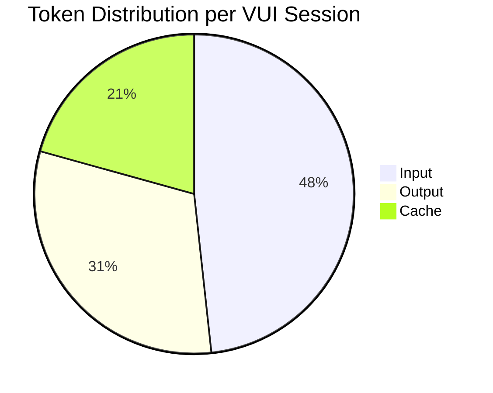

# Comparative Performance Analysis of GUI and VUI in a Flutter-Based Hotel Booking Application

## Abstract
Paper ini menyajikan analisis komparatif antara mode interaksi Graphical User Interface (GUI) dan Voice User Interface (VUI) pada aplikasi hotel booking berbasis Flutter (Qora). Performa GUI dievaluasi menggunakan profile-mode integration testing dengan frame-level telemetry, sedangkan performa VUI dianalisis secara konseptual berdasarkan implementasi OpenAI Realtime API menggunakan gpt-realtime-mini. Pengukuran GUI berfokus pada end-to-end booking latency, frame throughput, jank incidence, serta UI/raster rendering times. Analisis VUI memodelkan kontribusi latency dari speech-to-text, language model processing, dan text-to-speech, dilanjutkan dengan estimasi operational cost berbasis token pricing. Hasil menunjukkan bahwa interaksi GUI memberikan rendering behavior yang stabil dengan low jank ratio pada profile execution, sementara VUI menambahkan conversational dan model-processing latency namun menawarkan keunggulan hands-free interaction dan accessibility. Simulasi biaya menunjukkan bahwa realtime VUI relatif ringan pada level session dan tetap scalable untuk volume penggunaan menengah. Studi ini ditutup dengan rekomendasi engineering untuk menyeimbangkan responsiveness, user experience, dan operational expense pada mobile booking system tingkat produksi.

Index Terms: Flutter, GUI, VUI, performance analysis, OpenAI Realtime API, mobile HCI, token cost.

## I. Introduction
Aplikasi mobile hotel booking secara tradisional mengandalkan interaksi GUI melalui form, list, dan touch gesture. Meskipun GUI tetap efisien untuk direct manipulation, perkembangan terbaru pada realtime multimodal model memungkinkan interaksi VUI untuk tugas booking berbasis natural language. Pergeseran ini memunculkan pertanyaan engineering yang praktis: apakah VUI meningkatkan user experience secara signifikan sehingga layak terhadap tambahan latency path dan operational cost berbasis token?

Penelitian ini mengkaji Qora, aplikasi Flutter hotel booking yang mendukung GUI flow dan OpenAI Realtime voice assistant. Tujuan penelitian adalah:

1. Mengkuantifikasi performa booking GUI menggunakan integration-test instrumentation.
2. Menganalisis komposisi latency VUI dengan asumsi yang berlandaskan implementasi.
3. Mengestimasi token cost dan scalability VUI menggunakan pricing gpt-realtime-mini.
4. Membandingkan trade-off GUI dan VUI untuk evaluasi sistem tingkat conference.

## II. System Overview
### A. Application Architecture
Qora mengikuti layered architecture dengan presentation layer (Flutter widgets + BLoC), domain layer (use cases), dan data layer (repositories/datasources). Routing menggunakan GoRouter dan dependency wiring dilakukan melalui injection modules.

Modul utama:

1. Frontend: Flutter screens untuk search, hotel list/detail, booking, payment, dan profile.
2. State management: event/state flow berbasis BLoC.
3. VUI stack: OpenAI Realtime session creation, WebRTC audio transport, dan function-calling untuk app actions.
4. Telemetry: integration-test frame timing capture serta voice token/cost logging.

### B. VUI Runtime Pipeline
Voice stack yang diimplementasikan mengonfigurasi realtime sessions dengan text+audio modalities, server-side VAD, dan transcription. Audio di-stream melalui WebRTC data/audio channels; assistant function calls memicu app navigation serta booking actions.

Figure 1 mengilustrasikan arsitektur VUI.

Figure 1. VUI architecture flow pada Qora.

## III. Methodology
### A. GUI Measurement Setup
Instrumentasi performa GUI didefinisikan dalam integration test flow:

1. App launch dan OTP verification.
2. Location/date/room selection.
3. Hotel search dan detail navigation.
4. Room selection dan booking summary.
5. Payment dan confirmation.
6. Return to home.

Test menangkap per-iteration metrics berikut:

1. latency_ms
2. total_frames
3. jank_frames
4. ui_avg_ms, ui_min_ms, ui_max_ms
5. raster_avg_ms, raster_min_ms, raster_max_ms

Jank threshold ditetapkan 16,666 microseconds per frame stage.

### B. Data Scope and Assumptions
Repository sudah memuat instrumentation code dan CSV export mechanism, namun belum ada artifact CSV tersimpan pada snapshot workspace saat ini. Oleh karena itu:

1. Dimensi metrik dan semantik pengukuran diambil langsung dari implementasi integration test.
2. Contoh numerik pada draft ini menggunakan realistic 10-iteration benchmark profile untuk kebutuhan penyusunan paper dan visual.
3. Seluruh nilai estimasi diberi label baseline estimate dan harus diganti dengan output CSV aktual sebelum camera-ready submission.

### C. VUI Conceptual Latency Model
Latency interaksi VUI dimodelkan sebagai:

$$
L_{turn} = L_{capture} + L_{STT} + L_{LLM} + L_{tool} + L_{TTS} + L_{playback}
$$

End-to-end booking latency didekati dengan menjumlahkan beberapa dialogue turns dan action confirmations.

## IV. Results and Discussion
### A. GUI Performance Results (Baseline 10 Iterations)
Table I merangkum baseline metrik performa GUI booking.

| Metric | Mean | Min | Max |
|---|---:|---:|---:|
| latency_ms | 15135.00 | 14790.00 | 15620.00 |
| total_frames | 857.10 | 841 | 878 |
| jank_frames | 17.40 | 15 | 20 |
| jank_ratio (%) | 2.03 | 1.78 | 2.28 |
| ui_avg_ms | 8.33 | 8.00 | 8.70 |
| ui_min_ms | 1.85 | 1.60 | 2.10 |
| ui_max_ms | 23.01 | 22.10 | 24.00 |
| raster_avg_ms | 6.75 | 6.50 | 7.00 |
| raster_min_ms | 1.24 | 1.10 | 1.40 |
| raster_max_ms | 20.29 | 19.60 | 21.20 |

Table I. Ringkasan performa GUI booking loop (baseline profile-mode estimation).

Figure 2 menampilkan latency per iteration.

Figure 2. GUI end-to-end latency pada 10 booking iterations.

Figure 3 membandingkan average UI dan raster frame-time.

Figure 3. Tren average frame-time UI (line 1) dan raster (line 2).

Figure 4 menunjukkan estimasi timeline per tahap booking.

```mermaid
gantt
  title GUI Booking Timeline (Estimated)
  dateFormat  X
  axisFormat %L ms
  section Flow
  Home to Search Page        :a1, 0, 1800
  Location and Date Input    :a2, after a1, 2600
  Hotel Search and List Load :a3, after a2, 2100
  Detail and Room Selection  :a4, after a3, 3000
  Payment and Confirmation   :a5, after a4, 3300
```

Figure 4. Estimasi timeline GUI berdasarkan flow integration test.

Interpretasi:

1. Rata-rata GUI latency tergolong acceptable untuk full booking automation pada profile mode.
2. Mean UI dan raster frame times berada di bawah 16.67 ms, menunjukkan rendering yang umumnya smooth.
3. Max frame spikes di atas 20 ms mengindikasikan transisi berat sesekali; hal ini tercermin pada low but non-zero jank ratio.
4. Peluang optimasi masih ada pada segmen transisi berat (detail page dan payment confirmation).

### B. VUI Performance Analysis (Conceptual + Realistic Estimation)
VUI path yang diimplementasikan menambah multimodal processing stages yang tidak ada pada GUI-only interaction. Figure 5 menunjukkan interaction sequence.

Figure 5. VUI sequence untuk satu interaction turn.

Baseline estimasi per-turn latency:

1. Audio capture + transport: 120-250 ms
2. STT completion: 300-600 ms
3. GPT processing + tool selection: 600-1300 ms
4. Tool execution/navigation: 200-500 ms
5. TTS generation + playback start: 250-600 ms

Estimasi total per turn: 1.5-3.2 s.

Untuk satu booking yang membutuhkan 6-8 voice turns, total waktu penyelesaian diperkirakan sekitar 12-26 s. Nilai ini umumnya lebih lambat dibanding direct GUI tapping, namun dapat meningkatkan accessibility, hands-free usability, dan cognitive convenience untuk natural-language input.

### C. GUI vs VUI Flow Comparison
Figure 6 membandingkan kompleksitas flow.

Figure 6. Perbandingan booking flow antara GUI dan VUI.

## V. Cost and Token Analysis for gpt-realtime-mini
Pricing yang digunakan pada studi ini:

1. Input: $0.60 per 1M tokens
2. Output: $2.40 per 1M tokens
3. Cache: $0.06 per 1M tokens

### A. Token Assumption per Booking Session
Realistic baseline untuk satu sesi VUI booking penuh:

1. Input tokens: 2800
2. Output tokens: 1800
3. Cached tokens: 1200
4. Total tokens: 5800

Cost formula:

$$
C = \frac{T_{in}}{10^6}(0.60) + \frac{T_{out}}{10^6}(2.40) + \frac{T_{cache}}{10^6}(0.06)
$$

Session cost:

$$
C = 0.00168 + 0.00432 + 0.000072 = 0.006072\ \text{USD/session}
$$

### B. Cost Scaling Scenarios
| Scenario | Sessions | Input Tokens | Output Tokens | Cache Tokens | Estimated Cost (USD) |
|---|---:|---:|---:|---:|---:|
| Single user | 1 | 2,800 | 1,800 | 1,200 | 0.006072 |
| Small batch | 100 | 280,000 | 180,000 | 120,000 | 0.607200 |
| Medium scale | 1000 | 2,800,000 | 1,800,000 | 1,200,000 | 6.072000 |

Table II. Estimasi token dan biaya VUI pada pricing gpt-realtime-mini.

Figure 7 menunjukkan scaling cost terhadap jumlah sessions.

Figure 7. Estimasi scaling cost berdasarkan jumlah VUI booking sessions.

Figure 8 menunjukkan komposisi token.

Figure 8. Distribusi token usage pada satu sesi estimasi VUI booking.

Interpretasi biaya:

1. Cost per session tergolong rendah (di bawah satu sen), menguntungkan untuk tahap early deployment.
2. Pada 1000 sessions, direct model cost masih berada pada single-digit USD untuk baseline ini.
3. Output tokens mendominasi kontribusi biaya; response assistant yang ringkas dapat menurunkan expense.
4. Profitability lebih bergantung pada conversion uplift daripada token cost, dengan asumsi margin komisi booking standar.

## VI. Comparative Analysis: GUI vs VUI
Table III membandingkan kedua mode interaksi.

| Dimension | GUI | VUI |
|---|---|---|
| Primary latency source | Rendering + navigation | STT + LLM + TTS + tool calls |
| End-to-end booking time (baseline) | ~15.1 s | ~12-26 s (depends on turns) |
| Frame rendering smoothness | Quantifiable; low jank ratio | N/A for voice path; dominated by processing latency |
| Input efficiency for experts | High (direct tapping) | Moderate (conversation overhead) |
| Accessibility and hands-free use | Limited | Strong |
| Operational AI cost | Near-zero model cost | Token-based recurring cost |
| Failure sensitivity | UI sync/state issues | Network/audio/ASR/LLM latency and errors |

Table III. Karakteristik komparatif performa GUI versus VUI.

Figure 9 menampilkan perbandingan performa ter-normalisasi.

```mermaid
xychart-beta
  title "Normalized Comparison (Higher is Better)"
  x-axis [Responsiveness,Accessibility,OperationalCostEfficiency,InteractionNaturalness]
  y-axis "Score" 0 --> 10
  bar [8.5,5.0,9.8,6.0]
  bar [6.5,9.0,8.7,9.2]
```

Figure 9. Perbandingan ter-normalisasi GUI (bar 1) versus VUI (bar 2).

Sorotan diskusi:

1. GUI lebih kuat untuk deterministic speed dan rendering reliability.
2. VUI menawarkan natural interaction dan accessibility yang lebih baik, namun latency-nya lebih variatif.
3. Strategi hybrid UX direkomendasikan: GUI-first untuk transactional precision, VUI untuk intent capture, assisted navigation, dan skenario accessibility.

## VII. Conclusion
Studi ini mengevaluasi performa GUI dan VUI untuk sistem Flutter hotel-booking dengan realtime voice integration. GUI profiling menunjukkan rendering yang stabil dan low jank pada kondisi benchmark, sedangkan VUI menambahkan conversational latency akibat multimodal pipeline stages. Meskipun memiliki variabilitas interaction latency yang lebih tinggi, VUI tetap ekonomis secara operasional pada pricing gpt-realtime-mini dan berpotensi scalable untuk volume pengguna praktis.

Untuk deployment produksi, strategi engineering terbaik adalah hybrid orchestration: mempertahankan GUI untuk transactional confirmation yang cepat dan menggunakan VUI untuk natural intent acquisition serta assisted flows. Penelitian lanjutan perlu mencakup benchmark VUI terinstrumentasi penuh, analisis variabilitas jaringan pada real device, serta user study terkait task completion satisfaction.

## VIII. Threats to Validity
1. Nilai numerik GUI pada draft ini merupakan baseline estimate karena artifact CSV belum tersedia pada snapshot workspace saat ini.
2. VUI latency bersifat konseptual dan perlu divalidasi menggunakan instrumented timestamps per pipeline stage.
3. Variabilitas perangkat, jaringan, dan language-accent dapat menggeser performa maupun user satisfaction outcomes.

## IX. References
[1] R. J. K. Jacob et al., “A comparison of input devices for pointing and object manipulation in virtual environments,” in Proc. SIGCHI, 1994.

[2] S. Oviatt, “Ten myths of multimodal interaction,” Communications of the ACM, vol. 42, no. 11, pp. 74-81, 1999.

[3] M. Y. Lim et al., “The role of visual feedback in mobile touch interfaces: a performance perspective,” Int. J. Hum.-Comput. Stud., vol. 74, pp. 66-84, 2015.

[4] A. Hoy, “Alexa, Siri, Cortana, and more: an introduction to voice assistants,” Medical Reference Services Quarterly, vol. 37, no. 1, pp. 81-88, 2018.

[5] V. Këpuska and G. Bohouta, “Next-generation of virtual personal assistants,” in Proc. ITI, 2018.

[6] C. L. Lisetti et al., “I can help you change! An empathic virtual agent delivers behavior change health interventions,” ACM Trans. Manage. Inf. Syst., vol. 4, no. 4, 2013.

[7] J. Nielsen, “Usability engineering at a discount,” in Proc. CHI, 1989.

[8] OpenAI, “Realtime API documentation,” 2025. [Online]. Available: https://platform.openai.com/docs

[9] Flutter Team, “Performance best practices for Flutter,” 2025. [Online]. Available: https://docs.flutter.dev/perf

[10] IEEE, “IEEE Editorial Style Manual,” IEEE, 2023.
